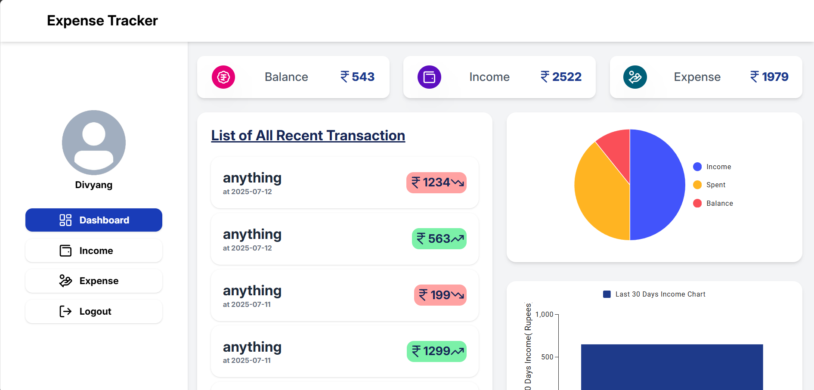
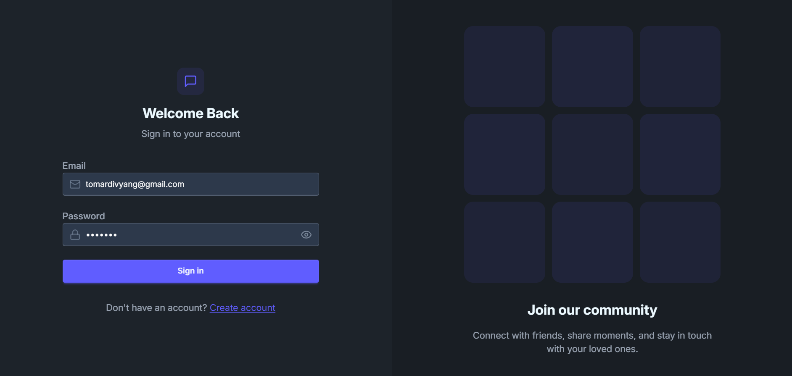
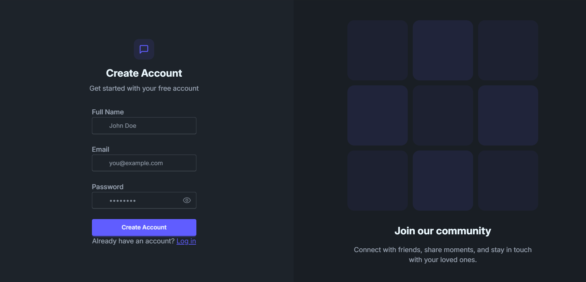
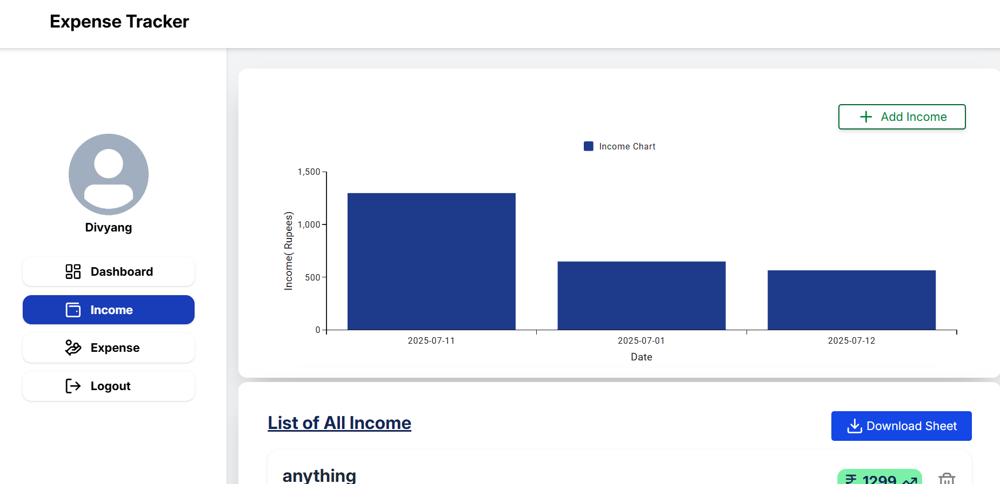
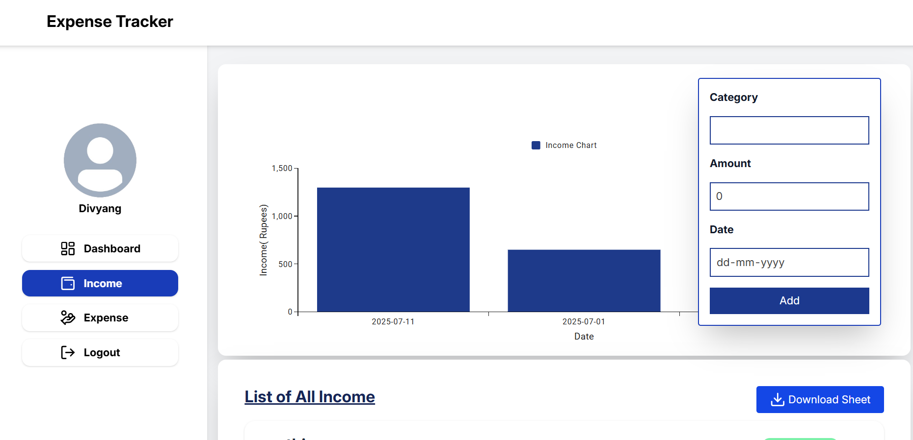
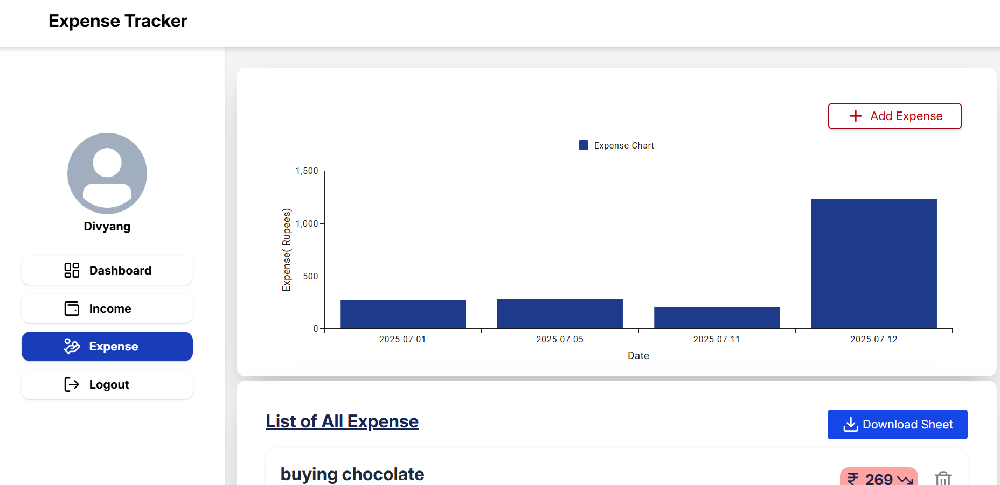
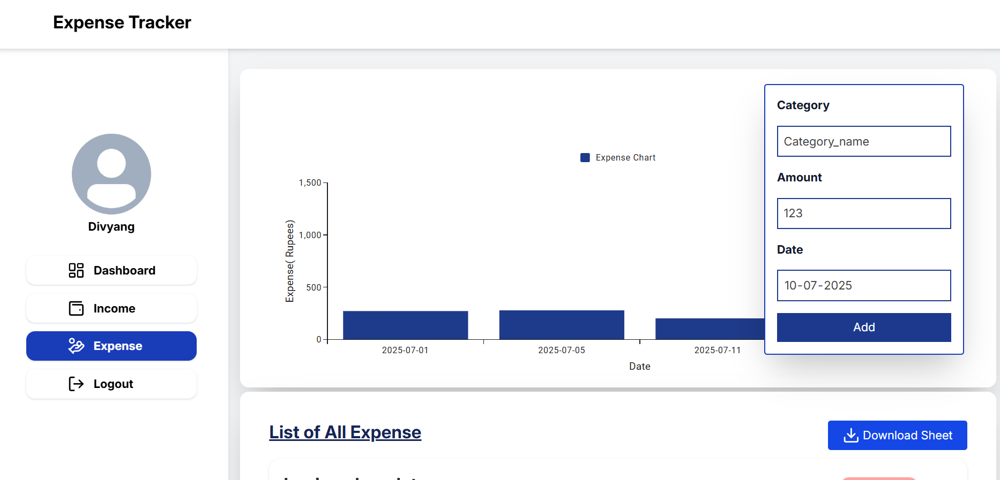

# Expense Tracker App

An intuitive and responsive full-stack **Expense Tracker** that lets users manage, visualize, and track their expenses in real-time with a clean dashboard, authentication, filtering, and rich UI/UX. Built using **MERN Stack** with modern development practices.



---

## Table of Contents

* [Features](#-features)
* [Tech Stack](#-tech-stack)
* [Installation](#-installation)
* [Usage](#-usage)
* [Screenshots](#-screenshots)
* [Best Practices Followed](#-best-practices-followed)
* [Project Highlights](#-project-highlights)
* [Future Improvements](#-future-improvements)
* [Author](#-author)

---

## Features

* 🔐 **User Authentication** (JWT-based)
* 📊 **Dashboard**: Total balance, income, and expenses breakdown
* 🔍 **Transaction Filtering** (by date, type, category,amount)
* ✍️ **CRUD Operations** on transactions
* ☁️ **MongoDB Integration** with Mongoose schema validation
* 🧾 **Category-wise breakdown** with real-time chart visualization (Recharts)
* ⚡ **Toast notifications** for actions

---

## Tech Stack

**Frontend:**

* React.js (Hooks, Context API)
* Axios
* Tailwind CSS
* React Router
* Mui x charts

**Backend:**

* Node.js
* Express.js
* MongoDB (with Mongoose)
* JSON Web Tokens (JWT)
* Bcrypt

**Dev Tools:**

* Postman
* Git & GitHub
* ESLint + Prettier
* VSCode

---
---

## Installation

```bash
# Clone the repository
https://github.com/your-username/expense-tracker.git

# Frontend Setup
cd client
npm install
npm run dev

# Backend Setup
cd ../server
npm install
npm run dev
```

Make sure you have a `.env` file in `server/` and cloudinary if you want to upload photos for profile picture:

```env
MONGO_URI=your_mongo_uri
JWT_SECRET=your_jwt_secret
CLOUDINARY_API=your_api
CLOUDINARY_SECRET=your_secret_for_server
CLOUDINARY_CLOUD_NAME=your_cloud_name
```

---

## Usage

* Create an account or login
* Add income or expenses
* View summary dashboard and charts
* Edit or delete entries
* Download Expense/Income Reports
---

## Screenshots

### Login Page



### Signup Page



### Dashboard View


### Income Section




### Expense Section




---

---

## Best Practices Followed

* Component reusability with separation of concerns
* Secure auth system (JWT + bcrypt)
* API modularization with controller/service layering
* Environment variable handling with zustand
* Tailwindcss based clean design
* Error handling in both frontend and backend

---

## Project Highlights

* Clean UX-focused dashboard
* Efficient data fetching and global state management
* Protected routes using JWT
* Optimized filtering logic and dynamic rendering
* Neat codebase with industry-standard folder structure
* Proper Indexing in Database for faster response

---

## Future Improvements

* Add Google OAuth login
* Add dark mode
* Add recurring expenses feature
* Mobile app version with React Native
* Profile upload section 

---

## Author

**Divyang Tomar**
B.E. Computer Science & Engineering (Data Science), VGEC
GATE Score: 660 (AIR: 1880)
[LinkedIn](https://www.linkedin.com/in/divyang-tomar-229bb0284/) | [GitHub](https://github.com/divyang9991)

---

> If you found this project helpful or inspiring, feel free to star this repo and connect!
